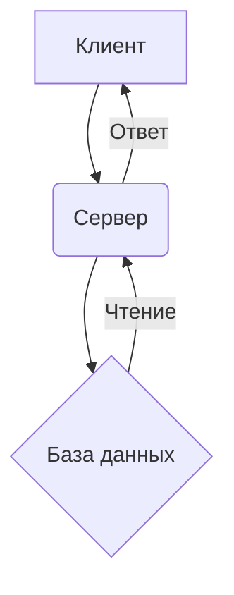

# Заголовок 1 
## Заголовок 2

Обычный текст с **жирным** и *курсивным* выделением.

Код внутри строки: `console.log('Hello')`.

Блок кода:
```javascript
function hello() {
  return 'World!';
}
```
> Тестовая  
> цитата

### 2. Alert-блоки (кастомный синтаксис)
```markdown
:::alert
Это предупреждающее сообщение
:::
```
### 3. Spoiler
???spoiler "Нажмите чтобы раскрыть"
Содержимое спойлера с **форматированием**:

- **Жирный**
- *Курсив*
- ~~Зачеркнутый~~ 
- [Ссылка](https://example.com)
???

### 4. Диаграммы


### 5. Emoji
Эмодзи: :smile: :heart: :fire: :rocket: